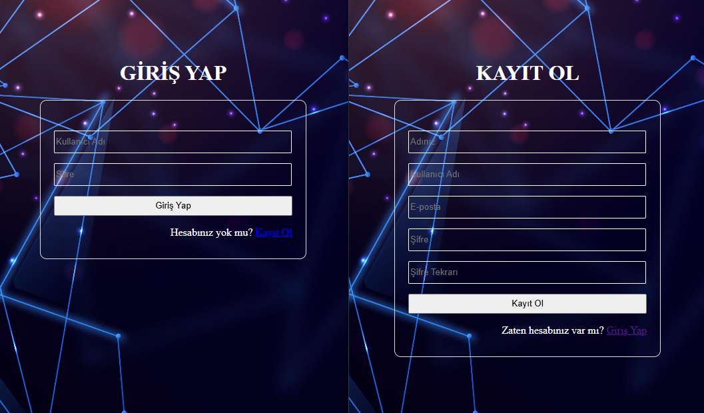

## 🖥️ Project UI / Proje Arayüzü  




# Web Site With Web Api

## 📌 Project Setup Instructions

### **1️⃣ Running the Backend **
- The backend project must be hosted on IIS (Internet Information Services).
- Create a **new site** in IIS and select the backend directory.
- The **Application Pool** must be compatible with .NET Core.
- The backend should be accessible via **http://localhost:8092/** or another specified port.

## 📌 Proje Kurulum Talimatları

### **1️⃣ Backend'i Çalıştırma **
- Backend projesi IIS (Internet Information Services) üzerinde çalıştırılmalıdır.
- IIS üzerinde yeni bir **site** oluşturun ve backend'inizin dizinini seçin.
- **Application Pool**, .NET Core ile uyumlu olmalıdır.
- Backend, **http://localhost:8092/** veya belirlenen başka bir port üzerinden çalışmalıdır.

### **2️⃣ Running the Frontend / Frontend'i Çalıştırma**
- The frontend project runs with Node.js.
- Use the following commands to start the frontend:

```sh
cd Frontend
npm install
npm start